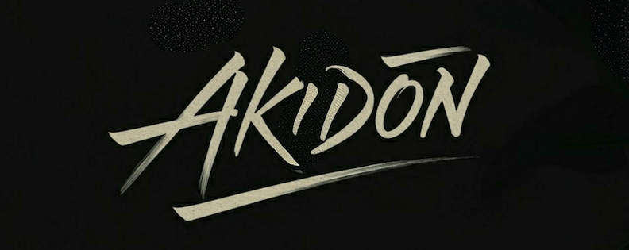

## Products
トクメモ＋ iOS/Android: Academic support app for Tokushima University

## Presentation
<!--START_SECTION:speakerdeck-->
- iOSDC Japan 2024 [なぜデフォルトが青色！？ Tint Colorの理由に迫る](https://speakerdeck.com/akidon0000/nazedehuorutogaqing-se-tint-colornoli-you-nipo-ru)

- 神山.swift [APIのない大学ログインWebサービスをWKWebViewとJavaScriptでアプリ化した話](https://speakerdeck.com/akidon0000/apinonaida-xue-rokuinwebsahisuwowkwebviewtojavascriptteahurihua-sitahua)

- 【徳島】第24回 カンファレンス動画鑑賞会 [try!Swift Tokyo 2024 参加報告 LT](https://speakerdeck.com/akidon0000/tryswiftcan-jia-lt)

- 【徳島】第19回 カンファレンス動画鑑賞会 [大学生向けアプリの開発において、レガシーと思っていた技術を採用した理由：学生開発者の挑戦](https://speakerdeck.com/akidon0000/da-xue-sheng-xiang-keahurinokai-fa-nioite-rekasitosi-tuteitaji-shu-wocai-yong-sitali-you-xue-sheng-kai-fa-zhe-notiao-zhan)

- 第18回大学教育カンファレンスin徳島2022 [学生プロジェクト運営でプロジェクトを活発化させるために有効であった手法の結果とその考察](https://speakerdeck.com/akidon0000/xue-sheng-puroziekutoyun-ying-depuroziekutowohuo-fa-hua-saserutameniyou-xiao-deatutashou-fa-nojie-guo-tosonokao-cha)

<!--END_SECTION:speakerdeck-->

## Links
[X(Twitter)](https://twitter.com/akidon0000) ・ [Qiita](https://qiita.com/akidon0000) ・ [Note](https://note.com/akidon0000/) ・ [Connpass](https://connpass.com/user/akidon0000/) ・ [AtCoder](https://atcoder.jp/users/akidon0000)

<!-- コミットを蛇が食うアニメーション -->
<picture>
  <source media="(prefers-color-scheme: dark)" srcset="https://github.com/akidon0000/akidon0000/blob/output/github-snake-dark.svg" />
  <source media="(prefers-color-scheme: light)" srcset="https://github.com/akidon0000/akidon0000/blob/output/github-snake.svg" />
  
</picture>

<!--START_SECTION:lapras-card-->

<!--END_SECTION:lapras-card-->

  

 

